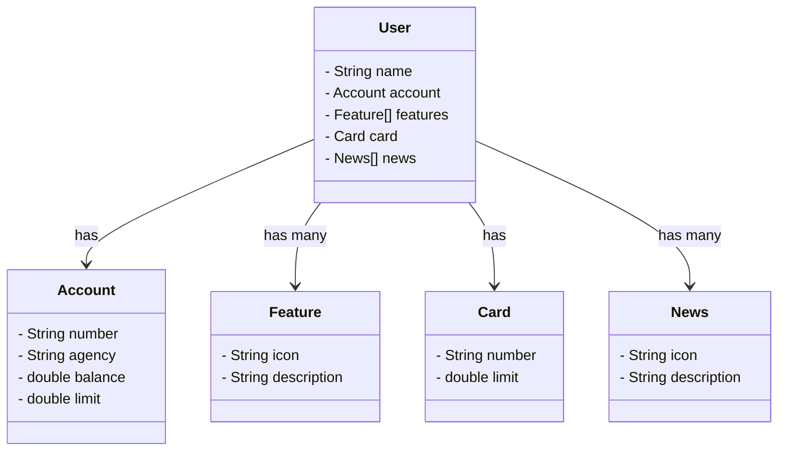

Projeto de fazer uma api REST - Aprendizado

classDiagram
    class User {
        - String name
        - Account account
        - Feature[] features
        - Card card
        - News[] news
    }

