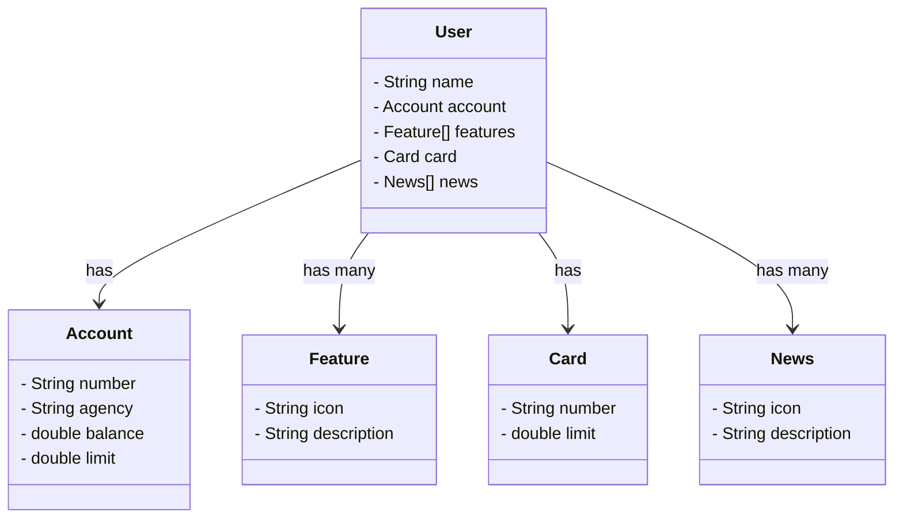

Projeto de fazer uma api REST - Aprendizado

classDiagram
    class User {
        - String name
        - Account account
        - Feature[] features
        - Card card
        - News[] news
    }

Entendendo o Desafio
Agora é a sua hora de brilhar e construir um perfil de destaque na DIO! Explore todos os conceitos explorados até aqui e replique (ou melhore, porque não?) este projeto prático. Para isso, crie seu próprio repositório e aumente ainda mais seu portfólio de projetos no GitHub, o qual pode fazer toda diferença em suas entrevistas técnicas 😎

Já dominamos o universo do desenvolvimento e construímos uma API REST utilizando o Java 17, a versão LTS mais recente repleta de novidades. Com o poder do Spring Boot 3, otimizamos nossa produtividade graças à sua habilidade de autoconfiguração. Além disso, facilitamos o acesso aos bancos de dados SQL com o auxílio do Spring Data JPA. Também destacamos a importância de uma documentação de API robusta e clara, utilizando o OpenAPI, ou Swagger. E com o Railway, simplificamos o Deploy de nossas soluções na nuvem. Agora, é hora de embarcar em um novo desafio e explorar um domínio de aplicação diferente, mantendo nosso foco em inovar e desenvolver soluções de alto padrão!

Repositórios Git
O Git é um conceito essencial no mercado de trabalho atualmente, por isso sempre reforçamos sua importância em nossa metodologia educacional. Por isso, todo código-fonte desenvolvido durante este conteúdo foi versionado usando :

github.com/falvojr/santander-dev-week-2023: Repositório com todo o código-fonte desenvolvido neste Desafio de Projeto (Lab);

github.com/digitalinnovationone/santander-dev-week-2023-api: Aqui você tem acesso a uma versão mais robusta desta mesma API, com melhorias e padrões adicionais implementados. Se quiser se desafiar e buscar uma referência mais completa, este é o caminho!

Bons estudos 😉
